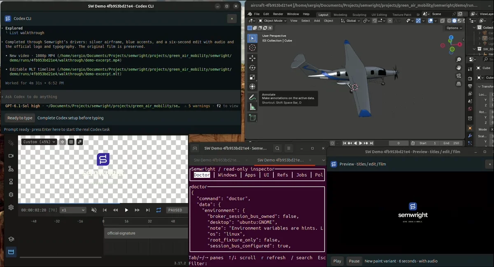

<h1 align="center">&nbsp;semwright</h1>

<p align="center">
  <strong>Use real software from any AI agent.</strong>
</p>

<p align="center">
  An open runtime that connects AI agents to desktop and professional applications through<br />
  structured operations, native APIs, and governed system interfaces.
</p>

<p align="center">
  Connect your tools once. Use them from any compatible agent.
</p>

<p align="center">
  <a href="./LICENSE-MIT"></a>
  <a href="./Cargo.toml"></a>
  <a href="./docs/installation.md"></a>
  <a href="./docs/mcp.md"></a>
  <a href="./docs/installation.md"></a>
  <a href="./VERIFY.md"></a>
</p>

<p align="center">
  <a href="./docs/quickstart.md"><strong>Quick start</strong></a> ·
  <a href="./docs/installation.md"><strong>Installation</strong></a> ·
  <a href="https://semwright.com/docs/"><strong>Documentation</strong></a> ·
  <a href="./docs/drivers.md"><strong>Drivers</strong></a> ·
  <a href="./VERIFY.md"><strong>Verification</strong></a>
</p>

```text
AI agent  →  Semwright  →  Blender · Godot · Browser · LibreOffice · Figma · KiCad · …
```

## One prompt. A connected creative workflow.

Watch Semwright update an aircraft’s materials in Blender, render a new camera shot, generate branded titles in Motion Canvas, and assemble the video with audio through MLT—all using Semwright’s drivers.

[](https://github.com/seradotcom/semwright/releases/download/v1.0.0/semwright-demo-60s-audio-r03.mp4)

Recorded in one take using an existing aircraft project. Waiting periods are accelerated; the final playback runs at normal speed. The workflow produces a new video and an editable timeline.

[**Watch the 60-second demo.**](https://github.com/seradotcom/semwright/releases/download/v1.0.0/semwright-demo-60s-audio-r03.mp4)

## Why Semwright?

AI agents can reason about a task. Reliably operating real software is a different problem: application
objects have identity and state, UI layouts move, mutations have side effects, and every agent should not
need its own one-off automation stack.

Semwright exposes real applications as structured operations behind one authorization boundary. It
prefers the strongest interface available—application/native APIs first, semantic accessibility and
governed system interfaces when needed, and controlled input or capture as explicit fallbacks. Every
operation still passes through the same broker, policy and audit path.

- **Structured operations first.** Use application objects and typed commands instead of reducing every
  task to screenshots and coordinates.
- **One authorization boundary.** CLI, MCP, Recipes, drivers and federated providers do not create
  separate privilege systems.
- **One runtime across compatible agents.** Change the agent without rebuilding every application
  integration from scratch.
- **Read back what happened.** Effects and application observations keep requested, expected and observed
  outcomes distinct.
- **Keep project state coherent.** Project Graph can track identity, dependencies and drift across repeated
  work instead of treating every run as a blank slate.
- **Local and inspectable.** The OSS runtime can operate locally; discovery is not permission, sensitive
  actions can require operator approval, and execution is auditable.

A typical path looks like this:

```text
Agent request             Semwright                              Software
"change this material" → typed operation → policy → readback → Blender
"update this scene"    → typed operation → policy → readback → Godot
"export this document" → typed operation → policy → artifact → LibreOffice
"find the Save button" → semantic query  → policy → reference → accessibility
```

Support is scoped per integration; a green fixture does not automatically certify every version or
interactive environment.

## Try Semwright

### 1. Install the native bundle — no Rust build required

Download the matching bundle and `SHA256SUMS` from [Semwright v1.0.0](https://github.com/seradotcom/semwright/releases/tag/v1.0.0).
Verify its checksum, extract the archive, and run its included helper:

| Platform | Bundle | Install from the extracted directory |
| --- | --- | --- |
| Linux x86_64 / aarch64 | `.tar.gz` or `.deb` | `./install.sh` (or the system package manager for `.deb`) |
| Windows x86_64 / ARM64 | `.zip` | `.\Install-Semwright.ps1` |
| macOS Apple Silicon / Intel | `.tar.gz` | `./install.sh` |

Every portable bundle includes the matched CLI, daemon, MCP frontend, TUI and sandbox helper,
plus checksums and reversible user-local installers. **Install the core once and choose which
interface to use; CLI/TUI/MCP are not separate versioned downloads.** Optional application
integrations remain separate.

[**Three-step quick start →**](docs/quickstart.md) ·
[Full installation, checksums and removal →](docs/installation.md#install-a-release-bundle)

### 2. Run `semwright setup`

The installer prints the exact installed command, so onboarding does not depend on PATH. Setup is
local, idempotent and non-overwriting: it creates an observe-only config plus a ready-to-copy MCP
snippet, but grants no desktop authority and starts no background service.

### 3. Start the broker and verify

Setup prints the exact broker, doctor, TUI and MCP paths for the current platform. Start the broker,
then run the printed doctor command from another terminal. `semwright-inspect` opens the read-only
terminal UI and the generated `mcp-client.json` points at the exact installed `semwright-mcp`.

### Develop from source with the synthetic desktop

For contributors, the repository also includes a synthetic desktop path. It exercises the real daemon,
CLI, Recipe runner and policy path without connecting to your real desktop or credentials. This is the
source-build path, not the normal installation path.

On Ubuntu 24.04 x86_64, install the
[development prerequisites](docs/installation.md#prerequisites), then:

```sh
git clone https://github.com/seradotcom/semwright.git
cd semwright

cargo build --locked -p semwright-daemon -p semwright-cli --bins
BIN_DIR=target/debug ./scripts/dev/fake-smoke.sh
```

The smoke will:

1. start an isolated fake Semwright daemon;
2. discover one exact `Export` control;
3. run a typed recipe through normal policy and dispatch;
4. report the observed `changed` result and audit metadata;
5. stop the daemon and remove the temporary runtime.

This is a functional first-use path, **not** live-desktop certification or a security verdict.

`Cargo.lock` is committed. Keep it and use `--locked`; do not run `scripts/dev/bootstrap.sh` on an
ordinary checkout. For the full build, per-user installation, portable package layout and uninstall
flow, use the [installation guide](docs/installation.md).

## Connect your agent

Semwright exposes a deliberately small MCP frontend that routes back through the same broker,
policy, references and audit path as the CLI.

`semwright setup` writes a ready-to-copy MCP client snippet using the exact installed executable path
for the current platform. Its shape is:

```json
{
  "mcpServers": {
    "semwright": {
      "command": "<absolute path to semwright-mcp>"
    }
  }
}
```

The MCP process does not grant desktop authority, approve mutations or start the broker for you.
See [MCP](docs/mcp.md) for socket/session configuration and
[governed MCP federation](docs/mcp-federation.md) for connecting external MCP providers.

## Native application SDK

Applications that already own their model, persistence and transactions can integrate through the
[Native SDK](docs/native-sdk/README.md) instead of adopting a Semwright-specific storage model. The
SDK exposes small optional cooperation contracts, adapts them through the canonical Driver
SDK/Driver Host, and keeps Broker/Policy, Project Graph and Effect Conformance as the existing
authorities. Rust and TypeScript surfaces, a file-backed reference profile and an application-owned
SQLite example are included in the repository. The portable SDK baseline has executed on Linux,
Windows and macOS across x64/ARM64 where native hosted runners are available; the real Host E2E is
currently an accepted Linux profile. See the [Native SDK verification](docs/native-sdk/VERIFY.md).

## Applications

Semwright has application-specific integrations in addition to generic desktop/platform backends.
The table below is intentionally compact; it describes the integration path, **not a blanket support
certificate**.

| Application / domain | Semwright path | Evidence boundary today |
| --- | --- | --- |
| **Blender** | First-party driver and semantic authoring/export | Real Blender 4.5.14 DriverProvider and add-on evidence exists; broader version/desktop coverage remains scoped |
| **Godot** | Driver + EditorPlugin + pinned runner | Production driver is exercised through Driver Host and pinned Godot CI; broader editor interaction remains scoped |
| **Chromium** | Private-profile CDP adapter | Real hosted browser integration exists on the Linux development line |
| **Figma** | Official Plugin API through authenticated loopback driver | Typed/fake-host/sandboxed CI exists; real Figma acceptance is separate |
| **LibreOffice** | First-party sandboxed UNO driver | Real hosted Writer/Calc/PDF operations execute through CLI -> daemon -> Broker -> DriverProvider; the curated surface is not the full UNO API |
| **OBS Studio** | `obs-websocket` driver | Fake-server, sandbox and disposable read-only OBS paths are exercised |
| **MLT video** | Offline timeline/render driver | Semantic/render tests exist; arbitrary Kdenlive/Shotcut round trips are not implied |
| **KiCad** | Curated driver integration | Deterministic IPC/conformance exists; fake IPC is not a real KiCad interoperability certificate |
| **Motion Canvas** | Typed project/render driver | Deterministic model generation and bounded render jobs |
| **Audio** | Faust + Ardour drivers | Curated synthesis, analysis and managed-session paths with explicit coverage gaps |

Full details live in the [platform matrix](docs/platforms.md),
[compatibility matrix](docs/compatibility.md), [Driver SDK guide](docs/drivers.md) and each
integration's own README.

## How it works

```text
compatible agent / MCP / CLI
            |
            v
+-----------------------------+
|          Semwright          |
| discovery · schemas · refs  |
| policy · approvals · audit  |
| jobs · artifacts · Effects  |
+-------------+---------------+
              |
       Provider Runtime
              |
      strongest available path
              |
      +-------+-------------------------------+
      |                                       |
      v                                       v
application/native APIs              semantic/system interfaces
      |                                       |
      +-------------------+-------------------+
                          |
                          v
                  controlled fallbacks
                   (input / capture)
                          |
                          v
                   real applications
```

Semwright does **not** replace MCP or an agent SDK. MCP is one way to reach the runtime and one kind
of provider Semwright can govern. The execution layer is responsible for capability discovery, policy,
application identity, bounded jobs, references, artifact handoff and audit.

A cross-application workflow can therefore remain explicit instead of hiding the transition between
tools:

```text
Agent
  |
  |  "Change this asset and update the project."
  v
Semwright
  |
  +--> Blender: inspect / author / export
  |
  +--> artifact.handoff: verify + transfer
  |
  +--> Godot: import / rescan / update
  |
  `--> readback + Effects: verify the bounded outcome
```

See [architecture](docs/architecture.md) for the full model.

## Reuse work and keep projects coherent

### Recipes — reuse a successful procedure

A typed Recipe captures a bounded multi-step procedure. Every step still re-enters normal broker
policy and reference validation.

[Learn about Recipes →](docs/recipes.md)

### Project Graph — know what became stale

Project Graph records persistent project identity, dependencies, derivations and drift. It can tell
higher-level workflows which outputs depend on which sources without turning stored identity into
permission.

[Learn about Project Graph →](docs/project-graph/INTEGRATION.md)

### Effects — verify what actually happened

Effects evaluates observations inside a declared scope. Missing readback stays unknown instead of
being promoted to a global success claim.

[Learn about Effects →](docs/effects/INTEGRATION.md)

## Build an integration

Choose the surface by what you are trying to connect:

| I want to… | Use |
| --- | --- |
| **Integrate an application that already owns its model, storage, revisions or transactions** | [Native SDK](docs/native-sdk/README.md) |
| **Build a persistent Semwright provider around an application API or long-lived session** | [Application Driver SDK](docs/drivers.md) |
| **Add a narrow, stateless external command** | [Plugin SDK](docs/plugins.md) |
| **Call Semwright from an agent or tool** | [CLI](docs/commands.md) or [MCP frontend](docs/mcp.md) |
| **Bring an existing MCP server under the same broker** | [Governed MCP federation](docs/mcp-federation.md) |
| **Move a verified file-backed artifact between integrations** | `artifact.handoff` in the [Driver SDK](docs/drivers.md#cross-driver-artifact-handoff) |

The Native SDK builds on the Driver SDK rather than replacing it. Start with the Native SDK when the
application remains the source of truth for its own state and only exposes optional cooperation
contracts. Use the Driver SDK directly when implementing the lower-level persistent provider protocol
and Host integration.

Drivers and plugins do not get ambient authority by existing. Their manifests, executable identity,
resource limits and requested filesystem/network surfaces are validated before use, and each
capability still enters broker policy.

## Security

Semwright is designed so that **discovery does not imply permission** and an agent cannot approve
its own sensitive request.

Observe is the default. Input, clipboard contents, screenshots, application launching, plugins and
application-native mutation require explicit authority. A separately granted unrestricted shell can
bypass this mediated surface; sandboxing a child does not sandbox an already-running application;
there is no claim of universal prompt-injection immunity.

Read [SECURITY.md](SECURITY.md), [permissions](docs/permissions.md) and the
[threat model](docs/security.md). Report sensitive vulnerabilities through the repository's enabled
private vulnerability-reporting channel, not a public issue.

## Status

Semwright 1.0.0 provides native bundle formats for Linux x86_64/aarch64, Windows x86_64/ARM64
and macOS arm64/x86_64. Application support stays scoped to each driver’s verified operations.

The 1.0.0 source is prepared for final release validation. Public assets become available only
after final exact-SHA distribution/certification and genuine independent security review pass.
Until publication, the release and demo download links above are reserved destinations.

Physical Hyprland and unlocked-Windows interactive certification remain explicit post-v1 work.
Windows external-MCP filesystem mounts remain fail-closed where path virtualization is unproven;
macOS TCC, signing and notarization are separate from hosted package validation.

The [release policy](docs/release-policy.md) requires an authentic external review of the frozen SHA,
zero blocking findings, explicit maintainer authorization and final installation validation.
Green CI alone does not approve publication or establish a formal security guarantee.

For exact evidence, use [VERIFY.md](VERIFY.md), [platform support](docs/platforms.md),
[compatibility](docs/compatibility.md), [release blockers](RELEASE_BLOCKERS.md) and
[security](SECURITY.md). Historical records under [`verification/`](verification/README.md) preserve the
source and environment they actually tested.

## Documentation and contributing

- [Installation and removal](docs/installation.md)
- [Troubleshooting](docs/troubleshooting.md)
- [Architecture](docs/architecture.md)
- [Platform support](docs/platforms.md)
- [Application Driver SDK](docs/drivers.md)
- [Native application SDK](docs/native-sdk/README.md)
- [Agent Skills](docs/skills.md)
- [Events and jobs](docs/events-jobs.md)
- [Workflow Distillation](docs/workflow-distillation.md)
- [Development](docs/development.md)
- [Contributing](CONTRIBUTING.md)
- [Support](SUPPORT.md)

Focused pull requests are welcome. Keep technical and verification claims bound to the exact source,
environment and scope that produced the evidence.

## License

Original core source is **MIT OR Apache-2.0**.

The isolated `integrations/kicad-driver` subtree is **GPL-3.0-or-later** with its own notices.

See [governance](GOVERNANCE.md), [changelog](CHANGELOG.md) and the
[architecture documentation](docs/architecture.md).
