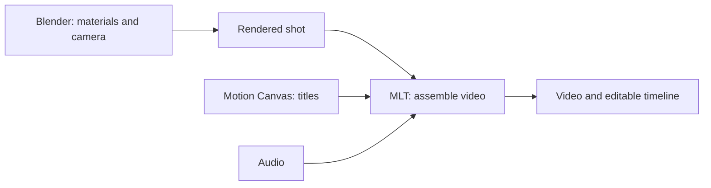
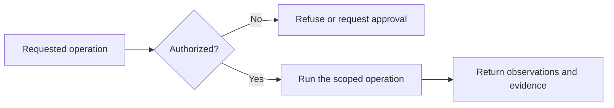
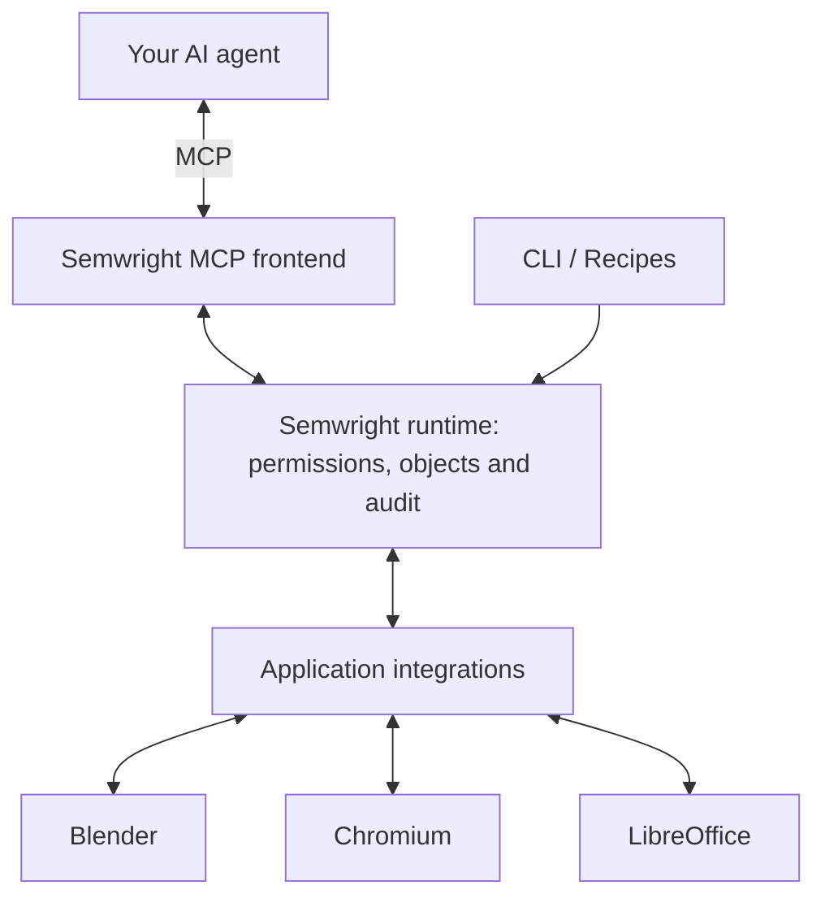

<h1 align="center">&nbsp;semwright</h1>

  <strong>Use real software from your AI agent.</strong>

  Semwright connects MCP-compatible agents to desktop and professional applications. 
  Work with application objects, control what can run, and inspect the result.

  
  
  
  
  
  

  <a href="#get-started"><strong>Get started</strong></a> ·
  <a href="#mcp-and-semwright"><strong>MCP and Semwright</strong></a> ·
  <a href="https://semwright.com/docs/"><strong>Documentation</strong></a> ·
  <a href="#choose-an-application"><strong>Applications</strong></a> ·
  <a href="#build-an-integration"><strong>Build an integration</strong></a>

## See it in action

One prompt updates an aircraft's materials in **Blender**, renders a camera shot, creates titles in **Motion Canvas**, and assembles the video with audio through **MLT**.

[**Watch the demo →**](https://github.com/seradotcom/semwright/releases/download/v1.0.0/semwright-demo-60s-audio-r03.mp4)

Recorded in one take using an existing aircraft project. Waiting periods are accelerated; final playback runs at normal speed. The workflow produces a video and an editable timeline.

The recorded workflow, simplified:

## Get started

You need an **MCP-compatible agent** and a **Linux, macOS or Windows computer**. Install Semwright once; the agent and the applications you want to use are installed separately.

### 1. Install and start Semwright

Download the package for your system and `SHA256SUMS` from the [1.0.0 release](https://github.com/seradotcom/semwright/releases/tag/v1.0.0). Verify the checksum, extract the archive, then run the installer inside it:

| System | Command inside the extracted bundle |
| --- | --- |
| Linux | `./install.sh` |
| macOS | `./install.sh` |
| Windows (PowerShell) | `.\Install-Semwright.ps1` |

Run the **setup command printed by the installer**. Setup creates your local configuration and agent connection file, beginning with read-only permissions.

Next, run the **Broker command printed by setup** and leave that terminal open. This starts the local process that handles your agent's requests.

[Package selection, checksum commands and installation help →](docs/installation.md#install-a-release-bundle)

### 2. Connect your agent

Setup creates **`mcp-client.json`** with the installed connection command. In your agent's MCP settings, add a **local / stdio** server named **`semwright`**, using the `command` path from that file. If your client accepts `mcpServers` JSON, merge the generated entry with your existing servers.

Restart or reconnect the agent to load the tools. Keep the Semwright terminal running.

[Find your connection file →](docs/quickstart.md#3-connect-an-agent-through-mcp) · [MCP configuration →](docs/mcp.md)

### 3. Try your first request

Send this to your agent:

> Use Semwright to list the capabilities available in this session. Explain what I can try next. Do not modify any files or applications.

The agent should report what is available in your environment. This checks the connection. Application workflows need their own integrations and permissions; setup does not install them or authorize edits.

Next, [choose the application you want to use](#choose-an-application). If the connection fails, run the **Doctor command printed by setup** and follow the [troubleshooting guide](docs/troubleshooting.md).

## Why Semwright?

Semwright is an open runtime that runs locally between your agent and your software.

- **Work with application objects.** Use typed operations for scenes, documents and other objects. Semwright prefers application APIs, with semantic desktop interfaces and explicit input/capture fallbacks where needed.
- **Keep access explicit.** Agent, CLI and application requests share the same permissions and approval checks. Discovering an operation does not grant permission to run it.
- **Inspect what happened.** Readback and execution evidence distinguish what was requested from what was observed. Missing evidence stays unknown.

An operation follows this path:

Observations describe the available evidence; they do not automatically prove that every intended change succeeded. [Read how it works →](docs/architecture.md)

## MCP and Semwright

[**Model Context Protocol (MCP)**](https://modelcontextprotocol.io/docs/learn/architecture) defines how an AI application connects to servers that expose tools, resources and prompts. The server implements what its tools actually do.

**Semwright provides the application runtime behind those calls:** application integrations, permissions, object references, bounded jobs and execution evidence. Its MCP frontend lets your existing agent use that runtime.

| Component | Role |
| --- | --- |
| **MCP** | The communication protocol for discovering and calling tools, and exchanging context. |
| **An MCP server** | A program that exposes tools and context using that protocol. |
| **Semwright** | An application execution runtime, reachable through its MCP server or directly through CLI and Recipes. |

**They work together.** Use MCP to connect your agent; use Semwright to discover and run supported application operations through a shared execution and permission model. An MCP server can implement permissions and application logic of its own; Semwright supplies that runtime across its integrations.

Already have an MCP server? Semwright can also bring an **owner-configured local stdio server** into the same permission and audit path. [MCP connection guide →](docs/mcp.md) · [Governed MCP federation →](docs/mcp-federation.md)

## Choose an application

These integrations expose selected operations. Coverage varies by application, version, platform and environment; a listed driver does not imply full application support.

| Application | Integration guide |
| --- | --- |
| Blender | [Scene authoring and export](crates/driver-blender/README.md) |
| Godot | [Editor and project operations](crates/driver-godot/README.md) |
| Chromium | [Browser operations through CDP](adapters/chromium/README.md) |
| LibreOffice | [Selected Writer, Calc and PDF operations](crates/driver-libreoffice/README.md) |
| Figma | [Plugin API integration](crates/driver-figma/README.md) |
| OBS Studio | [WebSocket integration](crates/driver-obs/README.md) |
| Motion Canvas and MLT | [Motion design](docs/motion-canvas/INTEGRATION.md) · [Video rendering](crates/driver-mlt-video/README.md) |
| KiCad | [Curated IPC integration](integrations/kicad-driver/README.md) |
| Faust and Ardour | [Audio synthesis](crates/driver-faust-audio/README.md) · [Managed audio sessions](crates/driver-ardour-audio/README.md) |

[Platform requirements →](docs/platforms.md) · [Verified coverage and limits →](docs/compatibility.md)

## Build an integration

| What you want to connect | Start here |
| --- | --- |
| An application that owns its model, storage and transactions | [Native application SDK](docs/native-sdk/README.md) |
| An application API or persistent session | [Application Driver SDK](docs/drivers.md) |
| A narrow external command | [Plugin SDK](docs/plugins.md) |
| An agent or existing MCP server | [CLI](docs/commands.md) · [MCP](docs/mcp.md) · [Governed MCP federation](docs/mcp-federation.md) |

The Native SDK builds on the Driver SDK and lets the application remain the source of truth for its own state. Integrations use the same permissions and audit path as the core runtime.

For reusable procedures and project state, see [Recipes](docs/recipes.md), [Project Graph](docs/project-graph/INTEGRATION.md) and [Effects](docs/effects/INTEGRATION.md).

## Security and verification

Setup starts with read-only permissions. Editing applications and other sensitive actions require explicit authority; an agent cannot approve its own sensitive request.

The release's hosted package tests do not certify every interactive desktop or application version. macOS signing/notarization, physical Hyprland certification and unlocked Windows desktop certification have separate limits. See the [release notes](https://github.com/seradotcom/semwright/releases/tag/v1.0.0) for the published version's evidence and limits.

[Security policy and private reporting](SECURITY.md) · [Permissions](docs/permissions.md) · [Threat model](docs/security.md) · [Verification records](VERIFY.md)

## Contribute

For source builds and the synthetic-desktop smoke test, start with [development](docs/development.md). The [installation reference](docs/installation.md#development-quickstart) includes the commands and prerequisites.

[Contributing](CONTRIBUTING.md) · [Support](SUPPORT.md) · [Changelog](CHANGELOG.md) · [Documentation](https://semwright.com/docs/)

## License

The original core source is **MIT OR Apache-2.0**. The isolated `integrations/kicad-driver` subtree is **GPL-3.0-or-later**, with its own notices. See [licenses and notices](NOTICE) and [governance](GOVERNANCE.md).
